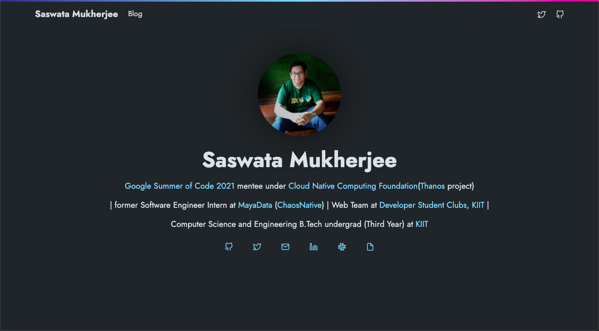

# saswatamcode-web

A personal blog website built with Hugo using [Doks theme](https://getdoks.org/).

Planning to migrate to Next.js + Tailwind soon(see [here](https://github.com/saswatamcode/saswatamcode-web/tree/next-migration)).

Visit https://saswatamcode.tech!

## Run
- Clone into repo
- Run `make web-serve`
- Add markdown in `content`
- Run `make format`

## CI and deps
- Markdown formatting and link checking by [mdox](https://github.com/bwplotka/mdox).
- Manage deps using [bingo](https://github.com/bwplotka/bingo).
